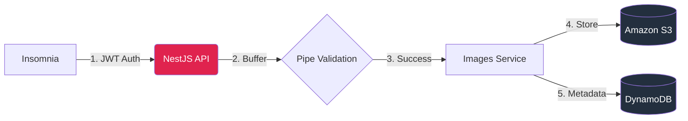

<div align="center">

  <h1>⚡ AssetFlux</h1>

  <p>
    <strong> High-performance Digital Asset Management API powered by AWS & NestJS.</strong>
  </p>

  <p>
    <a href="https://nestjs.com/" target="blank"></a>
    <a href="https://aws.amazon.com/" target="blank"></a>
    <a href="https://www.typescriptlang.org/" target="blank"></a>
    <a href="https://www.docker.com/" target="blank"></a>
  </p>

</div>

<br />

O **AssetFlux** é uma solução de engenharia de backend focada no processamento, armazenamento e distribuição segura de ativos digitais em escala.

## 🏗️ Arquitetura



## 📝 Descrição do Projeto

Este projeto é uma API RESTful desenvolvida com **NestJS** e **TypeScript** que permite aos usuários se registrarem, fazerem login e gerenciarem uploads de imagens. Todas as imagens são armazenadas no **Amazon S3**, enquanto os metadados são salvos no **Amazon DynamoDB**. A aplicação foi projetada com foco em performance e escalabilidade.

## 💡 Decisões de Engenharia

Este projeto foi arquitetado simulando um ambiente de **Digital Experience (DX)** de alta escala. As principais escolhas técnicas foram:

* **NestJS**: Escolhido pela arquitetura modular e injeção de dependência, facilitando a manutenção e testes em times grandes.
* **Amazon DynamoDB**: Utilizado para armazenar metadados devido à sua baixa latência e capacidade de escalabilidade horizontal (Serverless), ideal para catálogos de ativos massivos.
* **Amazon S3**: Padrão de indústria para armazenamento de objetos (Object Storage), garantindo durabilidade e disponibilidade dos assets.
* **Docker & LocalStack**: Implementados para garantir que o ambiente de desenvolvimento seja idêntico ao de produção, eliminando o problema de "funciona na minha máquina".


## ✨ Funcionalidades Principais

  * **Autenticação de Usuário**:
      * **Cadastro**: Criação de novos usuários com nome, e-mail e senha.
      * **Login**: Autenticação de usuários, retornando um token **JWT** para acesso seguro às rotas.
  * **Gerenciamento de Imagens**:
      * **Upload de Imagens**: Permite o upload de arquivos `jpg`, `jpeg`, `png` e `webp` para um bucket do S3.
      * **Listagem de Imagens**: Lista todas as imagens do usuário autenticado, com suporte a busca por nome e paginação.
      * **Exclusão de Imagens**: Deleta uma imagem tanto do S3 quanto do DynamoDB, garantindo que apenas o proprietário possa fazer a exclusão.
      * **Exportação de Dados**: Gera e exporta um arquivo CSV com o nome, URL remota e data de criação das imagens do usuário.

## 🛠️ Tecnologias e Ferramentas

  * **Framework**: [NestJS](https://nestjs.com/)
  * **Linguagem**: [TypeScript](https://www.typescriptlang.org/)
  * **Banco de Dados**: [Amazon DynamoDB](https://aws.amazon.com/dynamodb/)
  * **Armazenamento de Arquivos**: [Amazon S3](https://aws.amazon.com/s3/)

## 📂 Estrutura do Projeto

```text
src/
├── auth/           # Autenticação e Guards JWT
├── common/         # Decorators e Filtros de Exceção Globais
├── images/         # Domínio Principal (Upload, Listagem)
│   ├── dto/        # Transfer Objects (Validação)
│   ├── entities/   # Interfaces do DynamoDB
│   └── images.service.ts
├── main.ts         # Entry point
└── app.module.ts   # Orquestração de Módulos
```

## ⚙️ Instalação e Configuração

### Pré-requisitos📋

Certifique-se de ter as seguintes ferramentas instaladas:

  * [Node.js](https://nodejs.org/) (versão 18.x ou superior)
  * [npm](https://www.npmjs.com/)
  * [AWS CLI](https://docs.aws.amazon.com/cli/latest/userguide/cli-chap-install.html)

### Passo a Passo🚀

1.  Clone o repositório:

    ```bash
    $ git clone https://github.com/Linderval-Moura/AssetFlux.git
    $ cd AssetFlux
    ```

2.  Instale as dependências:

    ```bash
    $ npm install
    ```

3.  Configure as variáveis de ambiente:

      * Copie o arquivo de exemplo e preencha os valores (o arquivo .dockerignore já está configurado para proteger seu .env):

    <!-- end list -->

    ```env
    PORT=3000 # Ou a que desejar

    DATABASE_URL=sua_URL_DynamoDB # OU     
    DATABASE_URL=http://dynamodb-local:8000 # para comunicação interna Docker.

    PROVIDER_ACCESS_KEY_ID=sua_chave_de_acesso
    PROVIDER_SECRET_ACCESS_KEY=sua_chave_de_acesso_secreta
    AWS_REGION=
    
    S3_ENDPOINT=http://localstack:4566 #docker s3 da aws

    S3_ASSET_URL=http://localhost:4566 #para desenvolvimento local.

    # Na AWS, o padrão é https://nome-do-bucket.s3.amazonaws.com
    #S3_ASSET_URL=https://nome-do-seu-bucket-real.s3.amazonaws.com
    PROVIDER_BUCKET=nome-do-seu-bucket-s3

    AWS_SESSION_TOKEN=
    JWT_SECRET=sua_chave_secreta_longa_e_unica
    ```

4.  Configure as tabelas do DynamoDB e o bucket do S3:

      * Crie as tabelas `Users` e `Images` com os índices necessários no console da AWS.
      * Crie um bucket no S3 e configure a política de acesso público (somente leitura).

### Executando o Projeto▶️

Para rodar o projeto em modo de desenvolvimento (com auto-reload):

```bash
# Modo de desenvolvimento com auto-reload
$ npm run start:dev
```

Se você quiser usar os provedores de mock (sem conexão com a AWS), execute:

```bash
# Modo de desenvolvimento com mocks da AWS
$ npm run start:local
```

## 🐳 Docker

Para rodar a aplicação em um container Docker, siga os passos abaixo:

### Pré-requisito📋

Certifique-se de ter o [Docker](https://www.docker.com/products/docker-desktop/) instalado em sua máquina.

### Passo a Passo👣

1.  **Construa a imagem Docker:**
    Este comando irá compilar o `Dockerfile` e criar uma imagem com o nome `anjun25-compassstore`.
    ```bash
    $ npm run docker:build
    ```
2.  **Subir Infraestrutura (Docker):**
    Este comando inicia a API, o DynamoDB Local e o LocalStack (S3):
    ```bash
    $ docker compose up -d
    ```
    Sua API estará acessível em `http://localhost:3000` ou no que definiu na variável PORT em .env.

3.  **Configuração Inicial dos Serviços:**
    Como o ambiente local é efêmero, você deve criar o bucket manualmente na primeira execução.

    * Criar Bucket no S3 (LocalStack):
    ```bash
    $ docker exec -it localstack-s3 awslocal s3 mb s3://seu-bucket-name
    ```
    
4.  **🗄️ Database Initialization:** 
    você deve criar as tabelas manualmente na primeira execução ou caso os volumes do Docker sejam resetados. 
    * Execute os comandos abaixo no terminal do seu Linux:

    #### 4.1. Criar Tabela `Users`, responsável pelo armazenamento de credenciais e perfis de usuário.
    ```bash
    aws dynamodb create-table \
        --endpoint-url http://localhost:8000 \
        --table-name Users \
        --attribute-definitions \
            AttributeName=email,AttributeType=S \
        --key-schema \
            AttributeName=email,KeyType=HASH \
        --provisioned-throughput ReadCapacityUnits=5,WriteCapacityUnits=5
    ```

    #### 4.2. Criar Tabela Images com GSI (DynamoDB).
    * Tabela para metadados de arquivos. Inclui um Global Secondary Index (GSI) essencial para a funcionalidade de deleção por nome.
    ```bash
    aws dynamodb create-table \
        --endpoint-url http://localhost:8000 \
        --table-name Images \
        --attribute-definitions \
            AttributeName=userId,AttributeType=S \
            AttributeName=createdAt,AttributeType=S \
            AttributeName=name,AttributeType=S \
        --key-schema \
            AttributeName=userId,KeyType=HASH \
            AttributeName=createdAt,KeyType=RANGE \
        --global-secondary-indexes \
            "[{\"IndexName\": \"userId-name-index\", \"KeySchema\": [{\"AttributeName\": \"userId\", \"KeyType\": \"HASH\"}, {\"AttributeName\": \"name\", \"KeyType\": \"RANGE\"}], \"Projection\": {\"ProjectionType\": \"ALL\"}, \"ProvisionedThroughput\": {\"ReadCapacityUnits\": 5, \"WriteCapacityUnits\": 5}}]" \
        --provisioned-throughput ReadCapacityUnits=5,WriteCapacityUnits=5
    ```


## 🔌 API Endpoints

Para testar a aplicação, use o [Insomnia](https://insomnia.rest/download) ou o [Postman](https://www.postman.com/downloads/).

| Método | Endpoint | Descrição | Auth |
| :--- | :--- | :--- | :---: |
| `POST` | `/auth/register` | Criação de nova conta de usuário | ❌ |
| `POST` | `/auth/login` | Autenticação e geração de JWT | ❌ |
| `POST` | `/images/upload` | Upload de arquivo (JPG, PNG, WEBP) para S3 | ✅ |
| `GET` | `/images` | Listagem paginada de imagens do usuário | ✅ |
| `GET` | `/images?name=query` | Busca de imagens por nome parcial | ✅ |
| `DELETE` | `/images/:name` | Remoção do ativo no S3 e metadados no DynamoDB | ✅ |
| `GET` | `/images/export` | Download de relatório CSV dos ativos | ✅ |

## 🧪 Testes Automatizados
O projeto conta com uma pirâmide de testes completa para garantir a confiabilidade da lógica e da integração com a nuvem AWS.

#### 1. Testes Unitários

Focam na lógica isolada de serviços e controladores. O projeto exige e mantém uma cobertura mínima de 90%. Para rodar os testes, use:

```bash
# Rodar todos os testes
$ npm run test

# Testes com cobertura
$ npm run test:cov
```

### Configuração para Testes E2E🛠️

Para rodar os testes de ponta a ponta sem interferir no seu ambiente de desenvolvimento, utilize o arquivo .env.test na raiz do projeto.

#### Exemplo de .env.test:
```bash
PORT=3000
DATABASE_URL=http://localhost:8000
S3_ENDPOINT=http://localhost:4566
S3_ASSET_URL=http://localhost:4566
PROVIDER_ACCESS_KEY_ID=test
PROVIDER_SECRET_ACCESS_KEY=test
AWS_SESSION_TOKEN=test
PROVIDER_BUCKET=bucket-name-compassstore
JWT_SECRET=test-secret-key
```

#### 2. Testes E2E (End-to-End)
Validam o fluxo completo da aplicação, desde a requisição HTTP até a persistência real no S3 (LocalStack) e DynamoDB Local.

Os testes E2E são idempotentes: eles preparam automaticamente o ambiente, criando o bucket necessário no LocalStack antes da execução.
```bash
# Garantir que a infraestrutura Docker está rodando
$ docker compose up -d

# Executar a suite de testes E2E
$ NODE_ENV=test npm run test:e2e
```


## 📜 Licença

Este projeto está sob a licença MIT.